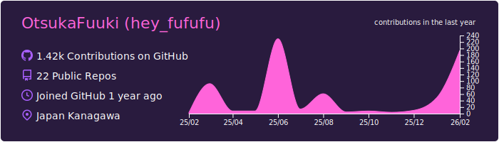
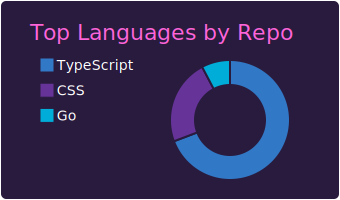
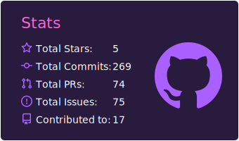

<!-- 

  

 -->
<h1 align="left">Hi 👋, I'm Fuuki Otsuka</h1>
<h2 align="left">Frontend developer from Japan🇯🇵</h2>

  I am a <b>24-year-old engineer</b> primarily focused on <b>Next.js</b> development. Currently,   
  I am mastering modern tech stacks to evolve from a <b>Frontend (React/Next.js)</b>   
  specialist into a comprehensive <b>Full-stack Developer</b> proficient in <b>Backend (Go/Nest.js)</b>.

 

## MyTechBlog
https://tully-blog.com

##

&nbsp;

  
  

<!-- 

 -->

<!-- 
&nbsp;
 -->

## 🛠 Tech Stack

  

 

## 🐍 Contribution Graph
<picture>
  <source media="(prefers-color-scheme: dark)" srcset="https://raw.githubusercontent.com/obregonia1/obregonia1/master/img/snake-dark.svg">
  <source media="(prefers-color-scheme: light)" srcset="https://raw.githubusercontent.com/obregonia1/obregonia1/master/img/snake.svg">
  
</picture>

