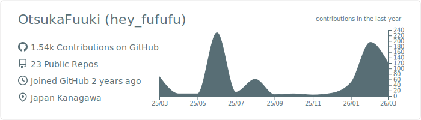

<h1 align="left">Hi 👋, I'm Fuuki Otsuka</h1>
<h2 align="left">Frontend developer from Japan🇯🇵</h3>

I am a **24-year-old engineer** primarily focused on **Next.js** development. Currently, 
I am mastering modern tech stacks to evolve from a **Frontend (React/Next.js)** specialist into a comprehensive **Full-stack Developer** proficient in **Backend (Go/Nest.js)**.

## MyTechBlog
https://tully-blog.com

###

<!-- 
&nbsp;
 -->

&nbsp;

## 🛠 Tech Stack

  

 

## 🐍 Contribution Graph
<picture>
  <source media="(prefers-color-scheme: dark)" srcset="https://raw.githubusercontent.com/obregonia1/obregonia1/master/img/snake-dark.svg">
  <source media="(prefers-color-scheme: light)" srcset="https://raw.githubusercontent.com/obregonia1/obregonia1/master/img/snake.svg">
  
</picture>

